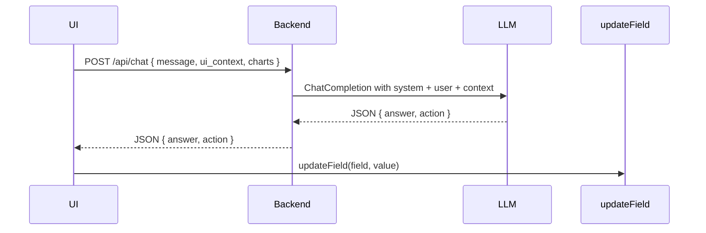

# README

A quick guide to get your ROI Calculator backend and frontend running via Docker Compose.

## 1. Environment Setup

1. Rename the example.env file to .env:
   Windows
   ```bash
   Rename-Item -Path example.env -NewName .env
   ```
   Linux
   ```bash
   mv example.env .env
   ```
2. Open `.env` in your editor and set your OpenAI API key:

   ```dotenv
   OPENAI_API_KEY=your_openai_api_key_here
   ```

   Ensure this file is named `.env` and exists in the project root **before** you start the services.

## 2. Run the Services

From the project root, execute:

```bash
docker-compose up --build
```

This will:

* Build and start the **backend** on `http://localhost:5000`
* Build and start the **frontend** on `http://localhost:3000`

You’re all set—hit those URLs in your browser or API client to verify everything’s up and running!


# How It Works

* **UI → Backend**: The React app sends each user message along with the current UI state to the backend endpoint `/api/chat`.
* **Backend → LLM**: A Flask API constructs a structured prompt including system instructions, UI context, and chart summaries, then calls the OpenAI Chat Completion API.
* **LLM → Backend → UI**: The LLM returns a JSON payload with:

  * **`answer`**: A natural language response.
  * **`action`**: An array of `[field, value]` pairs for updating UI inputs.
* **UI Applies Actions**: The frontend iterates over `action` pairs and calls `updateField(field, value)` for each.

## High-Level Flow



## Example Payloads

### Request (UI → Backend)

```json
{
  "message": "Change employees to 250 and show updated ROI.",
  "ui_context": {
    "companyName": "Acme Corp",
    "industry": "Software",
    "employees": 120,
    "revenueGrowthRate": 8,
    "totalInvestment": 2000000,
    "annualRevenue": 10000000,
    "profitMargin": 15,
    "roiPercentage": 25
  },
  "charts": {
    "revenueTrend_text": "5-year revenue trend rising, CAGR ~7%, minor dip in year 2.",
    "marginByQuarter_text": "Last 4 quarters margins: 12%, 14%, 15%, 15% (stable to up)."
  }
}
```

### Response (Backend → UI)

```json
{
  "answer": "Updated employees to 250. Based on your assumptions, ROI has increased slightly.",
  "action": [
    ["employees", "250"]
  ]
}
```

## Frontend Action Handling

```typescript
const handleAction = (action: [string, string][]) => {
  if (!Array.isArray(action)) return;
  action.forEach(([field, value]) => updateField(field, value));
};
```

> **Note:** Calculated fields (e.g., `annualRevenue`) may be placeholders until final formulas are implemented.


## AI Services Used and How

### OpenAI GPT-4.1-nano

This application uses the OpenAI Chat Completions API with the `gpt-4.1-nano` model for natural language understanding and action generation. The model is specified by the `OPENAI_MODEL` environment variable and can be replaced with any other OpenAI model (e.g., `gpt-4o`, `gpt-4o-mini`, or future releases).

- **Integration**: In the Flask backend (`/api/chat`), we call:
  ```python
  response = ChatCompletion.create(
      model=os.getenv('OPENAI_MODEL', 'gpt-4.1-nano'),
      messages=messages,
  )

## Prompt Structure

### System  
Defines the copilot role and response format (JSON with `answer` and `action`).

### User  
Includes:  
- The user message  
- Serialized `ui_context`  
- `charts_as_text`  

## Extensibility

- **To support other OpenAI models:**  
  Change the value of `OPENAI_MODEL` in your environment (e.g., to `gpt-4o`, `gpt-4o-mini`, etc.).

- **To support non-OpenAI providers:**  
  Abstract the `ChatCompletion` call behind an interface so you can plug in other LLM providers (e.g., Azure OpenAI, Anthropic, etc.).

## Environment Variables

* `OPENAI_API_KEY`: Your OpenAI API key (required)
* `OPENAI_MODEL`: Chat model to use (default: `gpt-4o-mini`)

---


